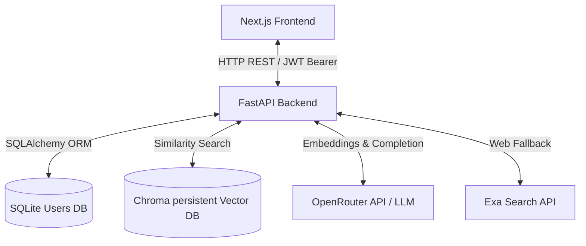
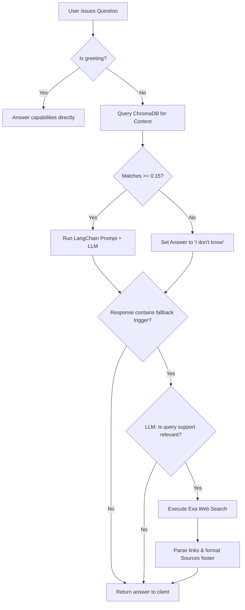
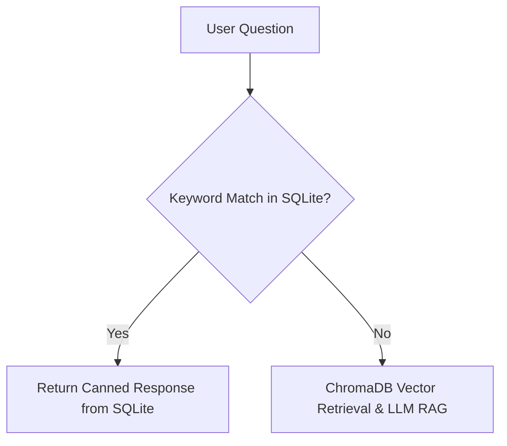
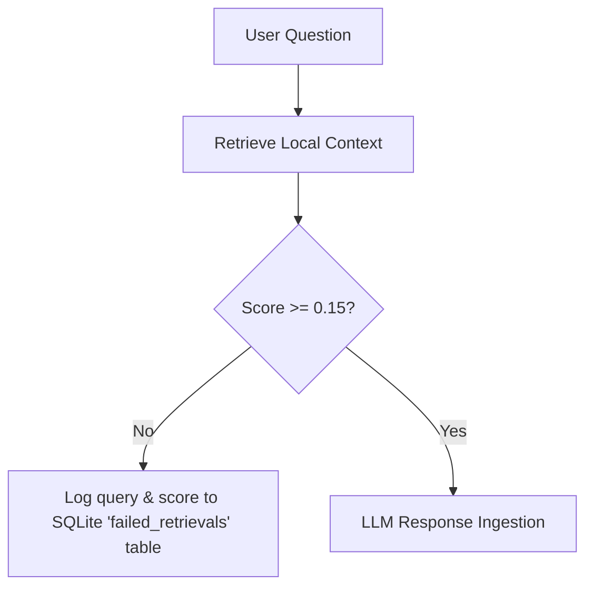

# Project Context: Industrial & Engineering Intelligence Copilot

This document provides a comprehensive technical overview of the **Valar** codebase—the Industrial & Engineering Intelligence Copilot.

---

## 1. Project Overview

### Problem Solved
Industrial operations suffer from document fragmentation. Engineers, maintenance technicians, and operators face delays accessing safety SOPs, equipment troubleshooting guides, piping and instrumentation diagrams (P&IDs), and compliance rules. 

**Valar** acts as a unified, role-restricted AI Copilot that ingests local documentation, parses query contexts, matches technical questions against indexed vector databases, and provides grounded answers. If local documents lack answers, it dynamically validates the question context and falls back to a web search engines to locate external manufacturer manuals or regulatory standards.

### System Architecture
The application runs on a classic Client-Server design:



### Main Workflows
1. **User Authentication**: Handled via standard username/password registrations. Different endpoints enforce different security access privileges (Technicians vs. Managers).
2. **Knowledge Base Ingestion**: Managers upload PDFs or TXT files. The server splits files into overlapping character chunks, embeds them via OpenRouter, and stores them in persistent vector memory.
3. **Session-Based Chat (RAG)**: Technicians issue queries within a conversation session. The server retrieves relevant text blocks from ChromaDB. If chunks are found above the relevance threshold, the LLM constructs an answer. 
4. **Fallback Web Retrieval**: If similarity scores are low or the LLM cannot answer from context, the query is checked for technical support relevance. If validated, the pipeline queries Exa for external guides, filters out noise, formats source links, and returns the response.

### User Roles
- **Manager (`manager`)**: High-privilege role. Can upload new documents, list all indexed files on the server, review active support tickets (mark in progress/resolved, delete), and access analytics telemetry.
- **Technician (`technician`)**: Low-privilege role. Can create chat sessions, query the copilot for maintenance instructions, and file support tickets for unresolved issues.

---

## 2. Tech Stack

### Frontend
- **Framework**: Next.js 16 (App Router)
- **Language**: TypeScript
- **Styling**: Tailwind CSS v4, Vanilla CSS
- **Markdown Parsing**: `react-markdown` and `remark-gfm` (for tables, links, and styling in LLM outputs)
- **UI Components**: `lucide-react` (icons), standard interactive modals, collapsible sidebars, and custom typing placeholder effects.

### Backend
- **Framework**: FastAPI (v0.100+)
- **Language**: Python 3.8+
- **ASGI Server**: Uvicorn

### Databases
- **Relational Store**: SQLite (persisted at `Backend/users.db`) for managing user information and persistent chat sessions.
- **Vector Database**: ChromaDB (persisted at `Backend/chroma_db`) for handling local document search and vector indexing.
- **ORM**: SQLAlchemy

### Authentication
- **Mechanism**: JWT (JSON Web Tokens) Bearer authentication.
- **Hashing**: `passlib` with `bcrypt` (pinning `<4.0.0` or `<4.1.0` due to `passlib` compatibility constraints).

### AI & LLM Stack
- **AI Orchestrator**: LangChain Core, Community, and OpenAI Integration libraries.
- **Embeddings Model**: `openai/text-embedding-ada-002` (via OpenRouter API).
- **Primary Generator Model**: `openai/gpt-oss-120b` (via OpenRouter API).
- **Secondary Web Search**: Exa API (via the `exa-py` package).

---

## 3. Folder Structure

```
Valar/                             # Root Workspace Directory
├── Backend/                       # Python FastAPI Backend Service
│   ├── app.py                     # API Controllers, CORS config, and JSON endpoints
│   ├── auth.py                    # JWT validation, user dependencies, password hashing
│   ├── database.py                # Database connection, declarative models (User, Session, Message)
│   ├── rag_pipeline.py            # VectorDB retrieval, Exa search fallback, LLM chains
│   ├── requirements.txt           # Python dependency lists specific to the backend
│   └── test_grounding.py          # Standalone verification script for search tools
├── frontend/                      # Next.js Frontend Project
│   ├── public/                    # Static UI icons & layouts
│   ├── src/                       # Source code directory
│   │   ├── app/                   # Next.js App Router folders
│   │   │   ├── layout.tsx         # Root layout shell
│   │   │   ├── globals.css        # Main stylesheet, custom scrollbars, Tailwind imports
│   │   │   ├── page.tsx           # Home routing component (orchestrates Chat interface)
│   │   │   ├── login/             # User login page
│   │   │   ├── register/          # User register page
│   │   │   ├── manager_reg/       # Nested folders for Manager registrations
│   │   │   └── ops_admin/         # Manager panel (documents, tickets, FAQ, analytics)
│   │   └── components/            # UI components
│   │       ├── ChatInterface.tsx  # Interactive chat thread, sidebar history, and ticket forms
│   │       └── Upload.tsx         # Drag-and-drop document upload box
│   ├── package.json               # Frontend Node dependencies and build scripts
│   └── tsconfig.json              # TypeScript compilation setup
├── requirements.txt               # Frozen list of workspace Python packages
├── README.md                      # General system descriptions and setup guides
├── project_context.json           # Declarative JSON document summarizing application architecture
└── test_grounding.py              # Root-level validation script for the Gemini GenAI SDK
```

---

## 4. Backend Analysis

### API Endpoints

| Method | Endpoint | Auth Required | User Role | Description |
| :--- | :--- | :--- | :--- | :--- |
| `POST` | `/register` | No | Any | Creates a new user account, forcing the role to `technician`. |
| `POST` | `/register_admin` | No | Any | Creates a new user account, forcing the role to `manager`. |
| `POST` | `/token` | No | Any | Takes URL-encoded form credentials, returns a JWT token. |
| `GET` | `/users/me` | Yes | Any | Returns details of the current authenticated user (`username`, `role`). |
| `POST` | `/upload` | Yes | `manager` | Uploads a document to `uploaded_files/` and indexes it into Chroma. |
| `GET` | `/files` | Yes | `manager` | Returns metadata of all files saved in the `uploaded_files/` folder. |
| `POST` | `/ask` | Yes | Any | **Deprecated** single-shot RAG endpoint; runs a query without a session context. |
| `GET` | `/sessions` | Yes | Any | Lists chat sessions belonging to the user in descending chronological order. |
| `POST` | `/sessions` | Yes | Any | Spawns a new chat session initialized with the title `"New Chat"`. |
| `GET` | `/sessions/{session_id}/messages` | Yes | Any | Retrieves the message logs inside a specific session ID. |
| `POST` | `/sessions/{session_id}/ask` | Yes | Any | Submits a question within a chat session. Saves messages and updates title. |
| `DELETE` | `/sessions/{session_id}` | Yes | Any | Deletes a chat session and cascade-deletes its child message logs. |
| `GET` | `/` | No | Any | Simple health check endpoint indicating service uptime. |

### Authentication Flow
1. **Password Security**: Uses `passlib` with the `bcrypt` hashing handler. Password inputs are truncated to 72 bytes.
2. **Access Token Generation**: Encodes user details (`sub`: username, `role`) using the standard HMAC SHA-256 (`HS256`) algorithm with a 30-minute expiry constraint.
3. **Protected Route Access**: 
   - `get_current_user` decodes the bearer authorization header using a secret key, validates expiration, queries the SQLite DB, and returns the user model.
   - `get_current_admin_user` intercepts the authenticated user profile and verifies if `role == "manager"`. If not, it blocks execution with a `403 Forbidden` response.

### Declarative Database Models
- `User`: Handles credential validation. Has a one-to-many relationship with `ChatSession`.
- `ChatSession`: Represents a single chat thread. Belongs to a `User` and contains many `ChatMessage` instances.
- `ChatMessage`: Stores raw message details. Belongs to a `ChatSession`. Tracks `role` (`user` or `assistant`), `content`, and creation timestamp.

### Business Logic Highlights
- **Dynamic Thread Renaming**: Inside `/sessions/{session_id}/ask`, the backend checks if the current title is `"New Chat"`. If so, it renames the session to the first 30 characters of the technician's query.
- **Strict Role Boundaries**: The registration endpoints force specific values. `POST /register` overrides any supplied role field and hardcodes `'technician'`. `POST /register_admin` hardcodes `'manager'`.

---

## 5. Frontend Analysis

### Routing
The application is structured around App Router routes:
- `/` - Home chat screen. Checks `localStorage` for `token`. If absent, redirects to `/login`.
- `/login` - Credential entry for technicians.
- `/register` - Registration page for technicians.
- `/manager_reg/reg` - Registration screen for managers.
- `/ops_admin/login` - restricted login portal for managers.
- `/ops_admin` - Restricted manager control dashboard, featuring nested tab panels:
  - **Knowledge Documents**: Uploads documents and lists active indexes.
  - **Support Tickets**: Reviews active user issues.
  - **FAQ Canned Layer**: Admin mockup for canned rules.
  - **Analytics & Gaps**: Visualizes simulated usage logs.

### State & API Integrations
- All pages query API routes on `http://localhost:8000` via standard asynchronous browser `fetch` requests.
- Headers are populated with JWT bearer headers: `Authorization: Bearer ${token}`.
- User data like `token`, `role`, and `username` are stored inside the browser's `localStorage` for session persistence.
- **Support Tickets**: Ticket submissions, status transitions, and deletions are saved directly to `localStorage` under the key `"support_tickets"`. There is currently no backend counterpart database table or API endpoint.

---

## 6. Database Schema (SQLite)

```mermaid
erDiagram
    users {
        int id PK
        string username UNIQUE
        string hashed_password
        string role
    }
    chat_sessions {
        int id PK
        int user_id FK
        string title
        datetime created_at
    }
    chat_messages {
        int id PK
        int session_id FK
        string role
        string content
        datetime created_at
    }
    users ||--o{ chat_sessions : "has"
    chat_sessions ||--o{ chat_messages : "contains"
```

### Table Properties
1. **`users` Table**:
   - `id` (INTEGER, Primary Key): Unique database identifier.
   - `username` (VARCHAR, Indexed): User's unique login username.
   - `hashed_password` (VARCHAR): Secure password representation.
   - `role` (VARCHAR): User permission role (`manager` or `technician`).
2. **`chat_sessions` Table**:
   - `id` (INTEGER, Primary Key): Unique session thread identifier.
   - `user_id` (INTEGER, Foreign Key referencing `users.id`): Links thread to owner.
   - `title` (VARCHAR): Custom name for the chat interface history display.
   - `created_at` (DATETIME): Timestamp of session creation.
3. **`chat_messages` Table**:
   - `id` (INTEGER, Primary Key): Unique message identifier.
   - `session_id` (INTEGER, Foreign Key referencing `chat_sessions.id`): Links to parent session.
   - `role` (VARCHAR): Message author role (`user` or `assistant`).
   - `content` (VARCHAR): Text content.
   - `created_at` (DATETIME): Timestamp when message was stored.

---

## 7. AI Pipeline



### Ingestion Pipeline
- **Document Processing**: Uses LangChain `PyPDFLoader` for PDF documents and `TextLoader` for text inputs.
- **Chunking Logic**: Chunks are processed via `RecursiveCharacterTextSplitter` with `chunk_size = 1000` and `chunk_overlap = 200` characters.
- **Embeddings Store**: Chunks are mapped into vectors via OpenRouter's `openai/text-embedding-ada-002` API endpoint and loaded into persistent local storage in `Backend/chroma_db`.

### Retrieval & Validation Flow
1. **Vector Retrieval**: Computes similarity search using `similarity_search_with_relevance_scores` fetching up to `k = 4` blocks.
2. **Relevance Threshold Filtering**: Chunks with scores lower than `0.15` are discarded. If no matching chunks survive, retrieval returns `None`.
3. **System Prompts**: Prompt instruction mandates the LLM to restrict answers to the context blocks and output exactly: `"Sorry, I don't know based on the given context."` if facts are missing.
4. **Trigger Detection & Fallback**:
   - If the LLM generates a refusal message (e.g. contains `"don't know"`), the pipeline calls a secondary validation chain (`is_support_relevant`) asking the model to verify if the request covers troubleshooting, compliance, or safety.
   - If evaluated as `YES`, the server launches an Exa API request targeting `"{query} technical support troubleshooting manual"`.
   - The Exa response is cleaned (inline links are de-duplicated, citations are parsed, and source links are appended to the response markdown block).

---

## 8. Existing Features Checklist

- [x] **User Management**:
  - [x] User registrations (technicians).
  - [x] Manager account registrations.
  - [x] Bearer JWT creation and token authorization checks.
- [x] **Document Indexing**:
  - [x] Drag-and-drop document upload panel.
  - [x] LangChain document loaders (PDF + Text).
  - [x] Persistent ChromaDB vector index storage.
- [x] **Chat Interface**:
  - [x] Persistent chat session histories.
  - [x] Session deletion with database cascades.
  - [x] Dynamic renaming of chat titles.
  - [x] Collapsible sidebar with conversation search.
  - [x] Suggested queries.
  - [x] Auto-scrolling, markdown formatting, tables, and code snippets.
- [x] **AI RAG Pipeline**:
  - [x] Vector store similarity ranking with 0.15 threshold controls.
  - [x] OpenRouter model inference and system instructions.
  - [x] Dynamic support categorization query loops.
  - [x] Exa Web Search API fallback parsing and formatting.
- [x] **Manager Console**:
  - [x] Document listing view.
  - [x] Simulated Support Tickets CRUD interface.
  - [x] Simulated FAQ mapping builder.
  - [x] Simulated Knowledge Gap Analytics meters.

---

## 9. Missing Features & Code TODOs

1. **Persistent Support Tickets**:
   - The ticket manager on `/ops_admin` and the ticket submission in `ChatInterface.tsx` store everything in the user's browser `localStorage`. When another user logs in, they cannot see tickets, and managers cannot query a centralized database.
2. **Dynamic FAQ Cache Engine**:
   - The FAQ match rules in `/ops_admin` are mock representations. The RAG pipeline does not evaluate user questions against an FAQ cache to bypass expensive LLM calls.
3. **Analytics Instrumentation**:
   - The Knowledge Gap analytics panel shows hardcoded values. There are no logging mechanisms or database tables mapping when queries fail context searches or triggers fallbacks.
4. **Local Document Sources**:
   - When answers are loaded from local documents, the source filenames are not attached or returned to the client (unlike the web fallback search which returns URLs).
5. **Ingestion Metadata Tracking**:
   - The backend `/upload` API saves documents to disk but doesn't log database indices tracking which manager uploaded what document and when. The file table lists files by scanning the raw folder directory.
6. **Unused Functions**:
   - The `is_greeting(text)` checks inside `Backend/rag_pipeline.py` are declared but are not integrated into `rag_answer(question)`.

---

## 10. Extension Points

- **FAQ Canned Response Engine**:
  - Insert within `rag_answer(question)` inside `Backend/rag_pipeline.py`. FAQ database keyword matching should execute *before* vector lookup. If matched, return the pre-set string immediately.
- **Analytics and Audit Logging**:
  - Insert within `ask_rag_session(...)` inside `Backend/app.py` or within `rag_answer` in `Backend/rag_pipeline.py` when RAG context is `None` or falls back to Exa. Log query text, similarity metrics, and timestamps to the database.
- **Chat Endpoints**:
  - Handled on the backend inside `Backend/app.py` via `POST /sessions/{session_id}/ask` and on the frontend inside `frontend/src/components/ChatInterface.tsx` (using `handleSubmit`).
- **Files NOT to modify**:
  - Next.js infrastructure controls: `frontend/next.config.ts`, `frontend/postcss.config.mjs`, and `frontend/tsconfig.json`.
  - Root `test_grounding.py` and local utility helpers.

---

## 11. Feature Implementation Guide

### 1. FAQ Canned Response Engine

To bypass vector search and LLM calls for critical questions, we will introduce a database-driven keyword matcher.



#### Files to Modify
- **`Backend/database.py`**:
  - Add the `FAQRule` table schema.
- **`Backend/app.py`**:
  - Create database schemas (`BaseModel`) for FAQ rules: `FAQRuleCreate`, `FAQRuleResponse`.
  - Add API endpoints:
    - `POST /faq` (restricted to managers) to insert rule tuples.
    - `GET /faq` to list active matching pairs.
    - `DELETE /faq/{rule_id}` (restricted to managers) to remove mappings.
- **`Backend/rag_pipeline.py`**:
  - Modify `rag_answer` signature to accept a database Session: `def rag_answer(question: str, db: Session) -> str`.
  - Add pre-flight check logic checking the user query against the `faq_rules` table. Perform case-insensitive substring comparisons or word boundary containment. If a match is found, return the response immediately.
- **`frontend/src/app/ops_admin/page.tsx`**:
  - Replace the simulated React state with native `fetch` requests querying `POST /faq`, `GET /faq`, and `DELETE /faq/{id}` using the manager authentication token.

#### Database Table to Add
```sql
CREATE TABLE faq_rules (
    id INTEGER PRIMARY KEY AUTOINCREMENT,
    keyword VARCHAR(255) UNIQUE NOT NULL,
    response TEXT NOT NULL,
    is_active BOOLEAN DEFAULT TRUE,
    created_at DATETIME DEFAULT CURRENT_TIMESTAMP
);
```

#### Exposed APIs
- `GET /faq`: Fetches all configurations.
- `POST /faq`: Creates a mapping. Payload: `{"keyword": "fire protocol", "response": "Evacuate via Sector 2 stairs."}`.
- `DELETE /faq/{id}`: Deletes a rule by ID.

#### Risks & Edge Cases
- **Keyword Collisions**: Multiple keywords matching a single query (e.g. "valve setup" and "valve"). *Fix*: Sort query matches by keyword length in descending order, matching the most specific rule first.
- **Overly Broad Matches**: Short keywords (like "run") matching unrelated questions. *Fix*: Require a minimum character count (e.g., >= 3 chars) or enforce full-word boundary checks.

---

### 2. Failed Retrieval Analytics

To capture knowledge gaps when technicians ask questions that local databases cannot answer, we will implement a logging service.



#### Files to Modify
- **`Backend/database.py`**:
  - Declare a new database model: `FailedRetrieval`.
- **`Backend/rag_pipeline.py`**:
  - Update context retrieval to log events. If the list of matches from `similarity_search_with_relevance_scores` is empty or average scores are below the relevance limit, insert the query text and the highest similarity score into the database.
- **`Backend/app.py`**:
  - Create response schema model for analytics logs.
  - Create REST endpoint:
    - `GET /analytics/gaps` (restricted to managers). It should query, group by query text, count occurrences, and return top failed queries.
- **`frontend/src/app/ops_admin/page.tsx`**:
  - Bind the Analytics UI tab meters and the "Top Unanswered Queries" list to load directly from `GET /analytics/gaps` instead of mock variables.

#### Database Table to Add
```sql
CREATE TABLE failed_retrievals (
    id INTEGER PRIMARY KEY AUTOINCREMENT,
    query_text TEXT NOT NULL,
    highest_score FLOAT,
    fallback_triggered BOOLEAN DEFAULT TRUE,
    created_at DATETIME DEFAULT CURRENT_TIMESTAMP
);
```

#### Exposed APIs
- `GET /analytics/gaps`: Aggregates entries from `failed_retrievals`, grouping matching query texts and returning counts.

#### Risks & Edge Cases
- **Database Write Latency**: Synchronously writing to SQLite on every failed search could slow down user chat responses. *Fix*: Perform the database log using a background task (`fastapi.BackgroundTasks`).
- **Telemetry Spam**: Repetitive queries by a single user could bloat tables and distort counts. *Fix*: Limit logging frequency for identical queries from the same session ID within a short time window.
- **Sensitive Data Exposure**: Failed queries might contain private data. *Fix*: Enforce sanitisation procedures to filter out passwords, API tokens, or phone numbers before DB logging.
